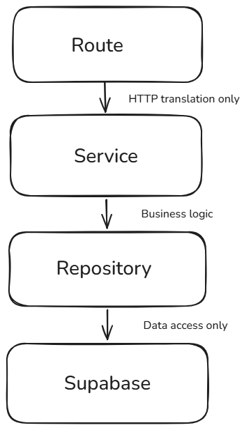

# 🏗️ Layered Architecture — Repository → Service → Route

> A clean, production-style implementation of the **Layered Architecture Pattern** in Next.js, built as part of the **FlyRank AI — Backend AI Engineering Internship**.


---

## 📌 Overview

This project demonstrates a **strict separation of concerns** using a 3-layer backend architecture. Instead of mixing database calls, business logic, and HTTP handling in one file, each responsibility lives in its own layer — making the code easier to test, maintain, and scale.

**The feature:** A post-view tracking endpoint that increments a post's `view_count` in Supabase and triggers a notification once the count crosses a threshold.

---

## 🧱 Architecture

```
┌──────────────┐        ┌──────────────┐        ┌──────────────┐        ┌────────────┐
│    Route     │  ───▶  │   Service    │  ───▶  │  Repository  │  ───▶  │  Supabase  │
│ HTTP layer   │        │  Business    │        │  Data access │        │  Database  │
│              │        │  logic       │        │  only        │        │            │
└──────────────┘        └──────────────┘        └──────────────┘        └────────────┘
```

| Layer | Responsibility | Rule |
|---|---|---|
| **Route** (`route.ts`) | Handles the HTTP request/response | No business logic, no direct DB calls |
| **Service** (`content.service.ts`) | Contains business rules (e.g. view-count logic, notification threshold) | No HTTP or DB code |
| **Repository** (`content.repository.ts`) | Talks directly to Supabase | No business logic |

## 📊 Architecture Diagram



---

## ⚙️ Tech Stack

- **Framework:** Next.js (App Router)
- **Language:** TypeScript
- **Database:** Supabase (PostgreSQL)
- **Pattern:** Repository → Service → Route (Clean Architecture inspired)

---

## 📂 Project Structure

```
src/
├── app/
│   └── api/
│       └── content/
│           └── route.ts           # HTTP layer (POST handler)
├── content/
│   ├── content.service.ts         # Business logic layer
│   └── content.repository.ts      # Data access layer
└── lib/
    └── supabase.ts                # Supabase client config
```

---

## 🔄 How It Works

1. **Client** sends a `POST` request with a `postId`.
2. **Route** validates the request and passes control to the Service — it does not touch the database.
3. **Service** fetches the post via the Repository, increments the view count, and checks if a notification threshold (100 views) has been reached.
4. **Repository** performs the actual Supabase read/write — it contains zero business rules.

```
POST /api/content
Body: { "postId": "uuid-here" }
```

**Responses:**
| Status | Meaning |
|---|---|
| `200` | View registered successfully |
| `400` | Missing `postId` |
| `500` | Server / database error |

---

## 🗄️ Database Schema

```sql
create table posts (
  id uuid primary key default gen_random_uuid(),
  title text not null,
  content text,
  view_count int default 0,
  created_at timestamp default now()
);
```

---

## 🧠 Design Decisions & Trade-offs

- **Why separate layers?** Each layer can be tested and modified independently — swapping Supabase for another database would only require changing the Repository, not the Service or Route.
- **Trade-off:** This adds more files and indirection for a simple feature, which can feel like overhead on small projects. The benefit shows as the codebase grows — business logic stays decoupled from infrastructure, making it far easier to unit test and extend.

---

## 🚀 Getting Started

```bash
# 1. Clone the repository
git clone https://github.com/Numair-Iqbal/flyrank-layered-architecture-assignment.git

# 2. Install dependencies
npm install

# 3. Add environment variables (.env.local)
NEXT_PUBLIC_SUPABASE_URL=your_supabase_url
NEXT_PUBLIC_SUPABASE_ANON_KEY=your_supabase_anon_key

# 4. Run the development server
npm run dev
```

---

## 👤 Author

**Numair Iqbal**
BS Computer Science — University of Layyah
Backend & AI Engineering Intern @ FlyRank AI

[](https://github.com/Numair-Iqbal)

---

<p align="center"><i>Built as part of the FlyRank AI Backend Engineering Track — July 2026</i></p>
